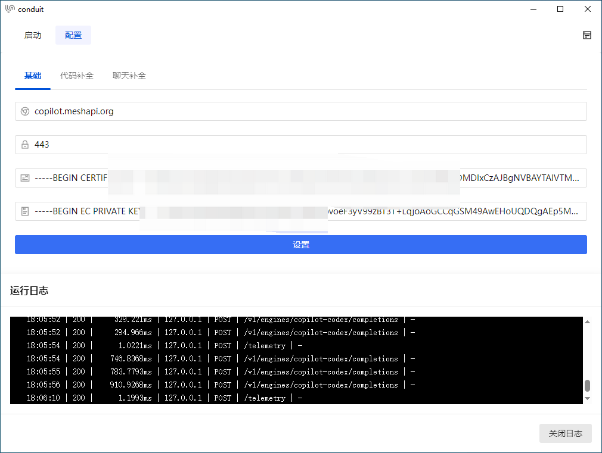
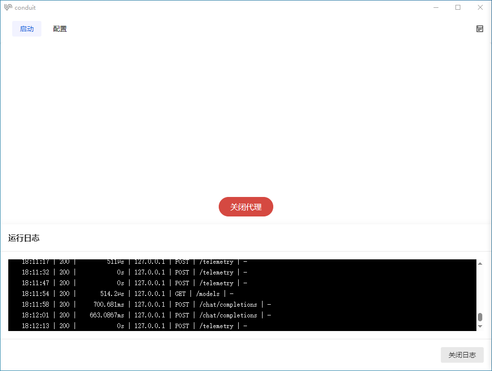
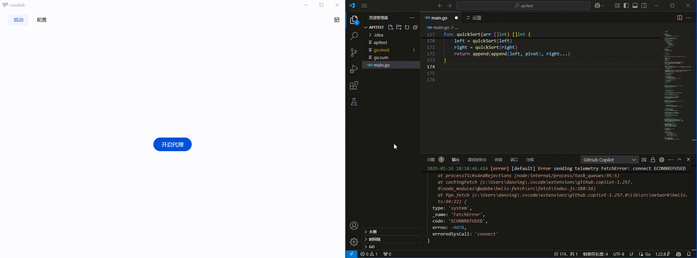
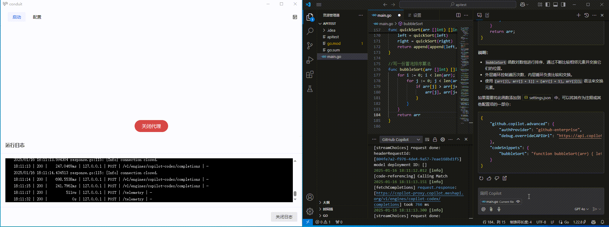

<p align="center">

</p>
<p align="center">
<a href="https://docs.gofiber.io/" target="_blank">Fiber文档</a>
<a href="https://wails.io/zh-Hans/docs/introduction" target="_blank">Wails文档</a>
<a href="https://vuejs.org/" target="_blank">Vue3</a>
<a href="https://tdesign.tencent.com/vue-next/getting-started">Tencent Design</a>
<a href="https://github.com/run-bigpig/conduit/issues" target="_blank">反馈</a>
</p>

### 介绍

没啥卵用

## 功能亮点
- 没啥亮点,功能简单 适合个人学习

### 软件截图





## IDE设置方法 (只兼容了VSCode和Jetbrains系列IDE)

### VSCode

1. 安装插件: `GitHub Copilot`
2. 修改 VSCode 的 settings.json 文件, 添加以下配置:

```json
"github.copilot.advanced": {
  "authProvider": "github-enterprise",
  "debug.overrideCAPIUrl": "https://api.copilot.conduit.com",
  "debug.overrideProxyUrl": "https://copilot-proxy.copilot.conduit.com",
  "debug.chatOverrideProxyUrl": "https://api.copilot.conduit.com/chat/completions",
  "debug.overrideFastRewriteEngine": "v1/engines/copilot-centralus-h100",
  "debug.overrideFastRewriteUrl": "https://api.copilot.conduit.com"
},
"github-enterprise.uri": "https://copilot.conduit.com"
```

### Jetbrains IDE系列

1. 找到`设置` > `语言与框架` > `GitHub Copilot` > `Authentication Provider`
2. 填写的值为: `copilot.conduit.com`


##  二次开发

```
[1]安装 node.js version18 以上 和 go 1.19 以上
[2]克隆项目  git clone https://github.com/run-bigpig/conduit.git
[3]进入项目  cd conduit/
[4]安装后端依赖  go mod tidy
[5]进入前端目录  cd frontend/
[6]安装前端依赖  npm install
[7]打开编辑器
[8]修改代码
[9]安装wails-cli  go install github.com/wailsapp/wails/v2/cmd/wails@latest
[10]编译  wails build -clean
[11]编译完成后，进入build/bin目录，找到conduit.exe，双击运行即可 (在不同平台上下，编译后的文件名称不同，请根据您的平台选择对应的编译文件)。
[12]如果编译失败，请查看编译日志，根据错误提示进行解决或者查看Wails文档
```

## 贡献

如果您对该项目有任何建议或发现了 Bug，欢迎提交 Issue 或 Pull Request。 请您遵守 BSD 协议，并遵守 Github 的行为规范。

## 许可证
[BSD 3-Clause License](https://opensource.org/licenses/BSD-3-Clause)

## 最后
欢迎fork、star、pull request，谢谢！

